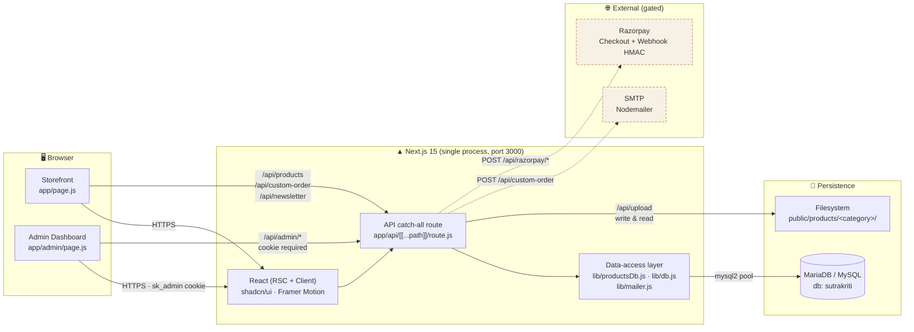
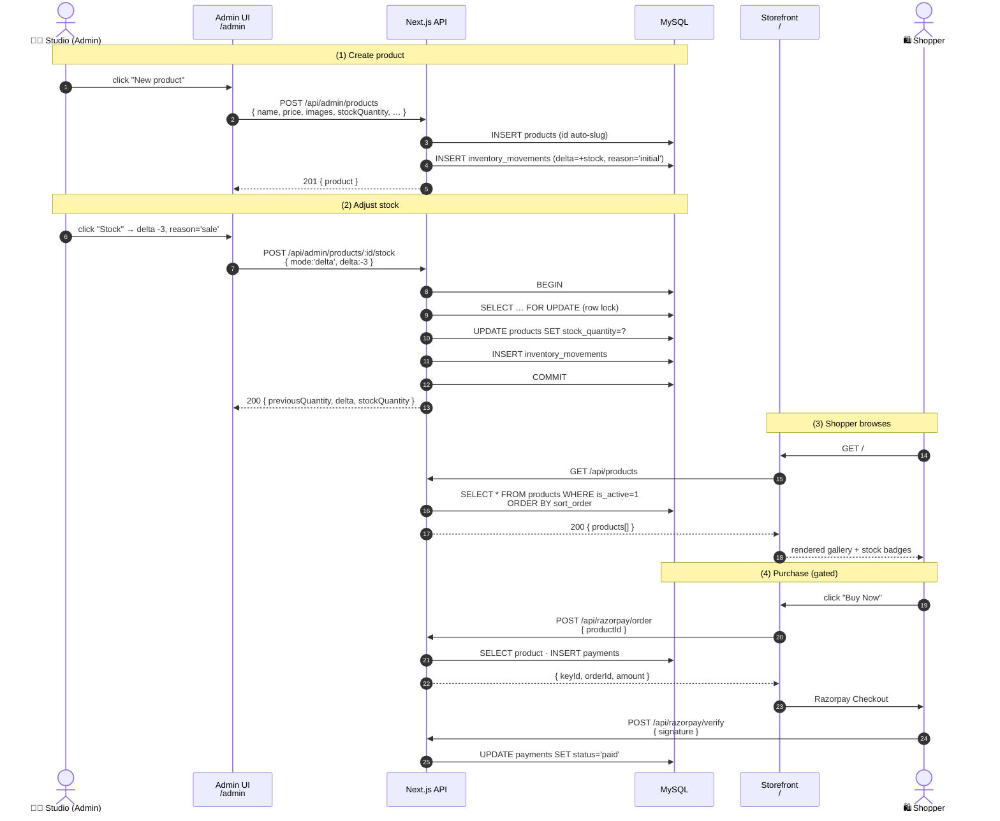
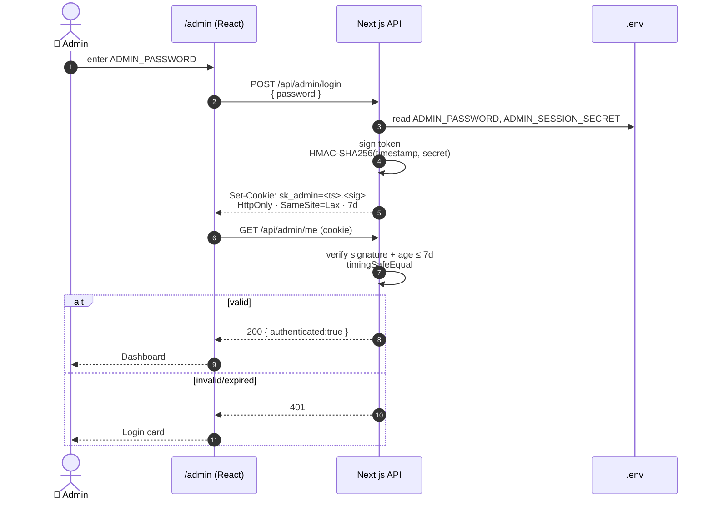
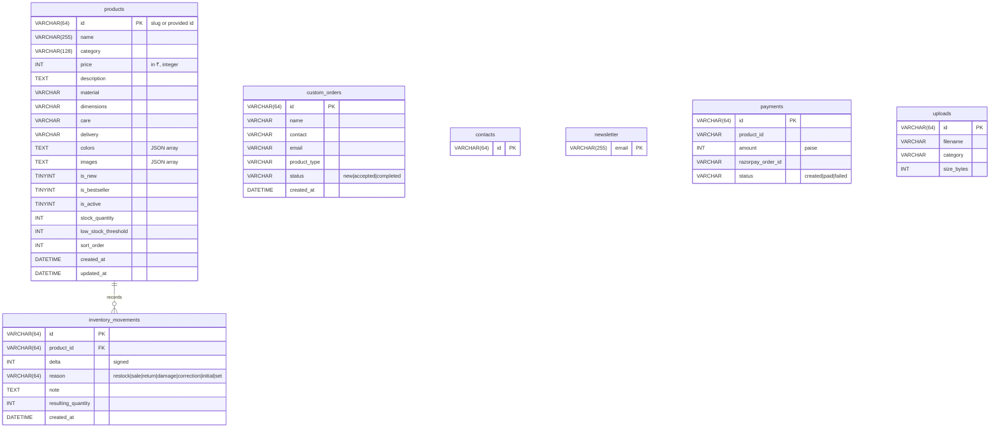
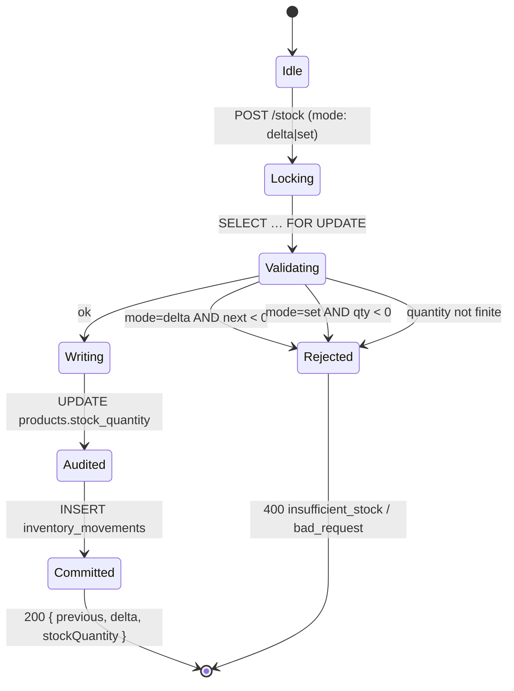
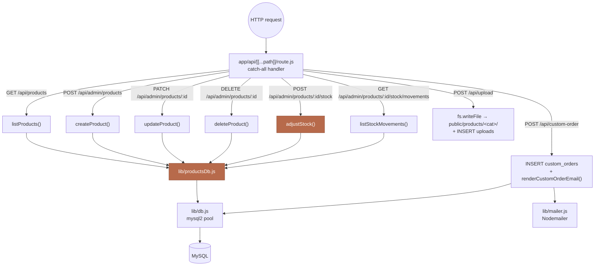

# SutraKriti — Luxury Handcrafted Crochet Brand

> *Every thread tells a story. Every creation is crafted with passion.*

A production-ready, boutique-quality **Next.js 15 + MySQL** website for SutraKriti — handcrafted crochet handbags, potli bags, bouquet blankets, flowers and personalised gifts.

---

## ✨ Highlights

- **Framework** · Next.js 15 (App Router, JS)
- **UI** · Tailwind CSS + shadcn/ui + Framer Motion + Lucide icons
- **Fonts** · Playfair Display (serif) + Cormorant Garamond (italic) + Inter (body) via `next/font/google`
- **Database** · **MySQL / MariaDB** (no MongoDB dependency)
- **Persisted product catalogue** · Products live in MySQL — full CRUD from the admin dashboard, with stock quantity, low-stock threshold and an inventory audit trail on every adjustment
- **Payments** · Razorpay (fully gated behind env flag — disabled by default, WhatsApp fallback)
- **Custom-order enquiries** · Saved to MySQL **and** emailed to the studio via SMTP (Nodemailer)
- **Product image pipeline** · Manual folder drop + `/api/upload` token-protected endpoint + CLI helper
- **SEO** · Semantic HTML, OG / Twitter Cards, JSON-LD Organization schema
- **Motion** · Morphing hero word, thread-drawing SVG, floating yarn particles, mouse-parallax tilt, scroll-triggered fades

---

## 📁 Project Structure

```
/app
├── app/
│   ├── api/[[...path]]/route.js   # All backend endpoints (catch-all, MySQL, mailer, upload, Razorpay)
│   ├── layout.js                  # Root layout: fonts, metadata, JSON-LD, Razorpay script
│   ├── page.js                    # Full luxury single-page site (client component)
│   ├── providers.js               # (client wrappers)
│   └── globals.css                # Design tokens, palette, animations, marquee, masonry
├── components/ui/                 # shadcn primitives (button, dialog, accordion, ...)
├── lib/
│   ├── db.js                      # mysql2 connection pool + schema init
│   ├── mailer.js                  # Nodemailer wrapper + custom-order email template
│   └── products.js                # Static product catalogue
├── public/
│   └── products/                  # 🧶 Drop product images here (served at /products/<file>)
│       ├── README.md                  # Folder usage guide
│       └── .gitkeep
├── scripts/
│   ├── init-db.js                 # One-shot MySQL schema bootstrapper
│   └── upload-product-image.sh    # CLI helper for /api/upload
├── .env                           # ALL runtime config (see below)
├── package.json
├── tailwind.config.js
├── DEPLOYMENT.md                  # 🚀 MilesWeb Node.js production deployment guide
└── README.md                      # (this file)
```

---

## 🏛️ Architecture

SutraKriti is a single-service Next.js 15 application that co-locates the
storefront (React), the admin dashboard and the JSON API in one process.
State lives in MySQL/MariaDB; images live on the filesystem under
`public/products/`; outbound integrations (SMTP + Razorpay) are optional
and gated by env vars.

### System overview



> On the Emergent preview pod, an extra `socat` proxy forwards
> `:8001 → :3000` so the ingress (which routes `/api/*` to `8001`)
> reaches the Next.js API. Production (MilesWeb / Vercel) exposes port
> 3000 directly.

### End-to-end product lifecycle

The single most important flow — how a product goes from studio intent to
storefront visibility — spans the DB, admin dashboard and public API.



### Admin authentication (HMAC cookie)



### Persistence — ER diagram



### Inventory-adjust state machine

Illustrates the guard rails `POST /api/admin/products/:id/stock` enforces,
including the transactional oversell check.



### Request routing & module map



---

## 🔐 Environment variables

All config lives in `.env`. Copy `.env.example`-style values from below and adjust for your environment.

### Core
| Var | Purpose |
|---|---|
| `NEXT_PUBLIC_BASE_URL` | Public URL of the site (used by CLI scripts) |
| `CORS_ORIGINS` | CORS allow-origin (default `*`) |

### MySQL
| Var | Default | Purpose |
|---|---|---|
| `MYSQL_HOST` | `127.0.0.1` | MySQL/MariaDB host |
| `MYSQL_PORT` | `3306` | Port |
| `MYSQL_USER` | `sutrakriti` | DB user |
| `MYSQL_PASSWORD` | — | DB password |
| `MYSQL_DATABASE` | `sutrakriti` | Database name |

### Razorpay (gated)
| Var | Purpose |
|---|---|
| `RAZORPAY_KEY_ID` | Test/Live Key ID from Razorpay Dashboard |
| `RAZORPAY_KEY_SECRET` | Corresponding secret (never expose) |
| `NEXT_PUBLIC_BUY_NOW_ENABLED` | `false` hides Buy Now button; `true` shows it (Razorpay still requires keys) |

### SMTP (custom order emails)
| Var | Notes |
|---|---|
| `SMTP_HOST` | e.g. `smtp-mail.outlook.com`, `smtp.gmail.com`, `smtp.sendgrid.net` |
| `SMTP_PORT` | `587` (STARTTLS) or `465` (SSL) |
| `SMTP_SECURE` | `true` for 465, else `false` |
| `SMTP_USER` | SMTP username |
| `SMTP_PASSWORD` | SMTP password / app password |
| `SMTP_FROM` | `SutraKriti <sutrakriti.help@outlook.com>` |
| `ORDERS_EMAIL` | Where new custom-order emails are sent |

If SMTP is not configured, orders are still saved to MySQL; email is silently skipped and `emailStatus` in the API response is `skipped`.

### Upload API
| Var | Purpose |
|---|---|
| `UPLOAD_DIR` | Relative to project root; default `public/products` |
| `UPLOAD_TOKEN` | Bearer token sent as `x-upload-token` header — **change in production** |

### Brand
| Var | Purpose |
|---|---|
| `WHATSAPP_NUMBER` | e.g. `917777932385` (no `+`) |
| `BRAND_INSTAGRAM` | Instagram profile URL |
| `BRAND_EMAIL` | Display email in footer |

---

## 🛠️ Local development

```bash
# 1. install deps
yarn

# 2. install MariaDB (or MySQL) locally
sudo apt-get install -y mariadb-server        # Debian/Ubuntu
brew install mariadb && brew services start mariadb   # macOS

# 3. create DB + user
mysql -uroot <<SQL
CREATE DATABASE IF NOT EXISTS sutrakriti CHARACTER SET utf8mb4 COLLATE utf8mb4_unicode_ci;
CREATE USER IF NOT EXISTS 'sutrakriti'@'localhost' IDENTIFIED BY 'sutrakriti_dev_pw';
GRANT ALL PRIVILEGES ON sutrakriti.* TO 'sutrakriti'@'localhost';
FLUSH PRIVILEGES;
SQL

# 4. configure .env  (see "Environment variables" above)

# 5. bootstrap schema (idempotent — also runs automatically on first request)
node scripts/init-db.js

# 6. run
yarn dev              # http://localhost:3000
```

---

## 🛣️ API reference

All routes are under **`/api`**. Every response is JSON. CORS is permissive by default.

### `GET /api/health`
Returns `{ ok, db, mail }` — handy for uptime checks and to confirm SMTP config.

### `GET /api/products`
Returns the live catalogue from MySQL (only `is_active = 1` rows), ordered by
`sort_order`:
```json
{ "products": [ { "id": "p-tote-cream", "name": "…", "price": 2299,
                  "stockQuantity": 10, "lowStockThreshold": 3, … } ] }
```
Legacy fields (`image`, `images`, `colors`, `new`, `bestseller`) are preserved
so the storefront needs no changes. The row is also enriched with `isActive`,
`stockQuantity`, `lowStockThreshold`, `sortOrder`, `createdAt`, `updatedAt`.

### `GET /api/products/:id`
Single product by id — `404` if missing or inactive.

### `POST /api/custom-order`
Custom enquiry. Body:
```json
{
  "name": "Ananya",           // required
  "contact": "+91...",         // required
  "email": "a@b.com",
  "productType": "potli",
  "colors": "gold, ivory",
  "size": "18×22 cm",
  "budget": "3000",
  "occasion": "wedding",
  "referenceImage": "https://...",
  "notes": "..."
}
```
Effects:
1. Inserted into `custom_orders` table (UUID id).
2. If SMTP configured → email is sent to `ORDERS_EMAIL` with a branded template.

Response:
```json
{ "ok": true, "id": "<uuid>", "emailStatus": "sent | skipped | failed" }
```

### `POST /api/contact`
`{ name, email?, message }` → inserted in `contacts` table.

### `POST /api/newsletter`
`{ email }` → upserted in `newsletter` table.

### `POST /api/razorpay/order`
**Gated.** Requires `RAZORPAY_KEY_ID`, `RAZORPAY_KEY_SECRET`, AND `NEXT_PUBLIC_BUY_NOW_ENABLED=true`.
- If any is missing → `503 { error: 'payment_unconfigured', whatsappNumber }`.
- Otherwise creates a Razorpay order, records it in `payments`, returns Checkout params.

### `POST /api/razorpay/verify`
Verifies HMAC signature. On success → marks `payments.status = 'paid'`.

### `POST /api/upload`
Upload a product image. Multipart form-data, single `file` field.
- **Auth**: header `x-upload-token: <UPLOAD_TOKEN>`.
- **Limits**: 8 MB, MIME `image/jpeg|png|webp|avif|gif`.
- Saves to `public/products/<timestamp>-<slug>.<ext>`.
- Records metadata in `uploads` table.

Response: `{ ok, id, filename, url, size, mime }` (url is public, e.g. `/products/172...jpg`).

### Admin (auth-protected)

The `/admin` dashboard is protected by a password stored in `ADMIN_PASSWORD`.
Login sets an httpOnly HMAC-signed cookie (`sk_admin`, 7-day expiry). Every
`/api/admin/*` route (except `login`) requires this cookie.

| Route | Method | Purpose |
|---|---|---|
| `/api/admin/login` | POST | `{ password }` → sets `sk_admin` cookie |
| `/api/admin/logout` | POST | Clears the cookie |
| `/api/admin/me` | GET | `200 { authenticated:true }` if signed in, else `401` |
| `/api/admin/stats` | GET | Aggregate counts + recent orders (Overview tab) |
| `/api/admin/custom-orders` | GET | List orders (`?status=new\|accepted\|completed\|all`) |
| `/api/admin/custom-orders/:id/action` | POST | `{ action, note?, timeline?, sendEmail? }` where `action ∈ { accept, complete, reopen, note }`. `accept` also sends the branded acceptance email with your studio note, timeline and UPI/secured-link payment instructions. |
| `/api/admin/uploads` | GET | List uploaded product images |
| `/api/admin/uploads/:id` | DELETE | Remove upload (file + DB row) |
| `/api/admin/contacts` | GET | Contact-form messages |
| `/api/admin/newsletter` | GET | Newsletter subscribers |
| `/api/admin/payments` | GET | Razorpay payments |
| `/api/admin/products` | GET | List every product (active + hidden), including stock |
| `/api/admin/products` | POST | Create a product · body: JSON with `name` (required), `category`, `price`, `description`, `material`, `dimensions`, `care`, `delivery`, `colors[]`, `images[]`, `isNew`, `isBestseller`, `isActive`, `stockQuantity`, `lowStockThreshold`, `sortOrder`. `id` is optional (auto-slugified from `name`). |
| `/api/admin/products/:id` | GET / PATCH / DELETE | Fetch, update (partial), or hard-delete a product. `PATCH` ignores `stockQuantity` — use the stock endpoint. `DELETE` cascades to `inventory_movements`. |
| `/api/admin/products/:id/stock` | POST | Adjust inventory. Body: `{ mode: "delta" \| "set", delta?: number, quantity?: number, reason?: "restock" \| "sale" \| "return" \| "damage" \| "correction", note?: string }`. Response returns `{ previousQuantity, delta, stockQuantity }`. Negative deltas are refused if they would drive stock below zero. |
| `/api/admin/products/:id/stock/movements` | GET | Recent stock movements (last 100) for an audit trail. |

**Dashboard UI** lives at **`/admin`** and shares the boutique design language — warm cream palette, serif headings, quiet motion.

> Access it via `https://<your-domain>/admin` (or `http://localhost:3000/admin` in dev). Use the password from `ADMIN_PASSWORD` in `.env`.
>
> For local development, set `ADMIN_PASSWORD` and `ADMIN_SESSION_SECRET` in your local `.env` before running the app. For MilesWeb production, add the same variables in the MilesWeb mPanel Node.js application environment variables section, set the app root to the folder containing `package.json`, and restart the app so the admin login starts working.

---

## 🧶 Managing products & inventory

Products are now **persisted in MySQL** (table `products`) instead of the
static `lib/products.js` file. The static file remains only as a seed source
for first-run installations — after seeding, the admin dashboard is the
single source of truth.

### From the admin dashboard (recommended)

If you want to bring the current local catalogue into production, use the dedicated sync helper in [scripts/sync-products.js](scripts/sync-products.js):

```bash
node scripts/sync-products.js --dry-run
node scripts/sync-products.js
```

Set `SOURCE_MYSQL_*` values for the local database source and keep `MYSQL_*` values for the production database target.

1. Sign in at `/admin` with `ADMIN_PASSWORD`.
2. Open the **Products** tab.
3. **Create** — click *New product*, fill the form (name is required; `id`
   is auto-slugified from name if omitted), set optional images (one URL
   per line — use the Uploads tab first if you need hosted paths), tick
   *Active* to show it on the storefront.
4. **Edit** — click *Edit* on any row. All fields except `stockQuantity`
   are editable here. Toggle *Active* to hide/show without deleting.
5. **Delete** — the trash icon deletes the row **and** its inventory
   history. This is destructive; confirm carefully.
6. **Inventory** — click *Stock* on any row to:
   - Adjust `+/-` (with a reason: restock / sale / return / damage /
     correction) — attempts to go below zero are rejected.
   - *Set exact* — override to a specific integer.
   - View the last 20 movements inline.

Overview stat cards surface totals, `active`, total on-hand stock,
low-stock count and out-of-stock count so the studio can act quickly.

### Programmatically

```bash
# List all products (admin view — includes hidden rows)
curl -s -b sk_admin=<cookie> $BASE/api/admin/products

# Create a product
curl -X POST -b sk_admin=<cookie> -H 'Content-Type: application/json' \
  $BASE/api/admin/products \
  -d '{"name":"Amber Clutch","category":"Handbags","price":1499,
       "stockQuantity":8,"lowStockThreshold":2,
       "images":["/products/handbags/amber.jpg"],"colors":["Amber","Ivory"]}'

# Restock (delta +10)
curl -X POST -b sk_admin=<cookie> -H 'Content-Type: application/json' \
  $BASE/api/admin/products/amber-clutch/stock \
  -d '{"mode":"delta","delta":10,"reason":"restock","note":"July batch"}'

# Sell one unit
curl -X POST -b sk_admin=<cookie> -H 'Content-Type: application/json' \
  $BASE/api/admin/products/amber-clutch/stock \
  -d '{"mode":"delta","delta":-1,"reason":"sale"}'

# Correct to an absolute value
curl -X POST -b sk_admin=<cookie> -H 'Content-Type: application/json' \
  $BASE/api/admin/products/amber-clutch/stock \
  -d '{"mode":"set","quantity":12,"reason":"correction","note":"annual audit"}'
```

### Seeding & migration

- On first request, `productsDb.seedProductsIfEmpty()` copies every entry
  from `lib/products.js` into the `products` table (starting stock: `10`
  per product, low-stock threshold: `3`).
- `node scripts/init-db.js` performs the same seeding and is safe to
  re-run (it only seeds when the table is empty).
- To add fresh seed data, either use the dashboard, the API, or add rows
  to `lib/products.js` **before** the first request and re-run
  `init-db.js` on an empty DB.

---

## 🗄️ Database schema

Auto-created on first request; also via `node scripts/init-db.js`.

| Table | Purpose |
|---|---|
| `products` | **Persisted product catalogue** — name, price, category, description, JSON `images` / `colors`, flags (`is_new`, `is_bestseller`, `is_active`), `stock_quantity` + `low_stock_threshold`, and `sort_order`. Managed via the admin dashboard **Products** tab or the `/api/admin/products` endpoints. |
| `inventory_movements` | **Append-only stock audit trail**. Every stock change (via API or the dashboard) writes a row with `delta`, `reason` (`restock` / `sale` / `return` / `damage` / `correction` / `initial` / `set`), `note` and the resulting `stock_quantity`. FK → `products.id` (cascade delete). |
| `custom_orders` | Bespoke enquiries from the Custom Order modal |
| `contacts` | Contact-form submissions |
| `newsletter` | Email subscribers (email is PK) |
| `payments` | Razorpay orders & verification results |
| `uploads` | Metadata for every uploaded product image |

All UTF-8 mb4, InnoDB, UUID primary keys (where applicable).

---

## 🖼️ Product images — organised by category

Product images live under `public/products/`, split into category folders that
mirror the collections on the storefront:

```
public/products/
├── handbags/          # Category: Handbags
├── potli-bags/        # Category: Potli Bags
├── flowers/           # Category: Flowers
├── home-decor/        # Category: Home Decor
├── uncategorised/     # Uploaded without a category
└── README.md
```

The canonical category list lives in `lib/categories.js`. Files are served
publicly at `/products/<category-slug>/<file>`.

### Four ways to add images

1. **Admin dashboard drag & drop** — Sign in at `/admin`, open the **Uploads**
   tab. Pick a category from the dropdown and drop image files onto the upload
   area (multi-file supported). Progress + result URLs appear inline.

2. **API upload**
   ```bash
   curl -X POST "$NEXT_PUBLIC_BASE_URL/api/upload" \
     -H "x-upload-token: $UPLOAD_TOKEN" \
     -F "category=handbags" \
     -F "file=@./my-tote.jpg"
   ```
   `category` also accepts a query string (`?category=flowers`) or `x-category`
   header. Omit it to save under `uncategorised/`.

3. **CLI helper**
   ```bash
   ./scripts/upload-product-image.sh ./my-tote.jpg handbags
   ```
   Category is the optional 2nd argument (`handbags`, `potli-bags`, `flowers`, `home-decor`).

4. **Manual drop / SFTP** — place files in the right category folder. Served
   instantly at `/products/<slug>/<file>`. Remember to also update the `image`
   / `images` field in `lib/products.js`.

Recommended: **1200 × 1500 px (4:5)** portrait, WebP or high-quality JPEG under
500 KB, colour-graded warm.

### Auth for the upload endpoint

`POST /api/upload` accepts **either**:
- `x-upload-token: <UPLOAD_TOKEN>` header (CLI / server-to-server / CI), **or**
- A valid `sk_admin` cookie (used automatically when uploading from the admin
  dashboard — no token exposed to the browser).

---

## 💳 Enabling Razorpay Buy Now

1. Log into <https://dashboard.razorpay.com> → **Account & Settings → API Keys**.
2. Generate **Test Keys** first (recommended).
3. Set in `.env`:
   ```
   RAZORPAY_KEY_ID=rzp_test_xxxxx
   RAZORPAY_KEY_SECRET=xxxxx
   NEXT_PUBLIC_BUY_NOW_ENABLED=true
   ```
4. Restart the app. **Buy Now** now appears on every product modal.
5. Test with Razorpay’s [test cards](https://razorpay.com/docs/payments/payments/test-card-details/). No real money moves.
6. When ready, switch to **Live** keys.

---

## 🎨 Design system

| Token | Value |
|---|---|
| Cream | `#F7F1E5` |
| Ivory | `#FBF7EE` |
| Beige | `#E9DDC7` |
| Terracotta | `#B76A4B` |
| Terracotta Dark | `#8F4E36` |
| Sage | `#A3B18A` |
| Brown | `#6D4C36` |
| Gold | `#C9A961` |
| Charcoal | `#2A211B` |

Typography:
- **Headings**: `Playfair Display` — optical size, tight letter-spacing.
- **Italic accents**: `Cormorant Garamond` — airy, editorial.
- **Body**: `Inter` — modern sans, high legibility.

All palette tokens are exposed as CSS variables (see `app/globals.css`) and as Tailwind utilities: `bg-cream`, `text-terracotta`, `bg-sage`, …

---

## 🧪 Testing

All backend endpoints are covered by the internal `deep_testing_backend_nextjs` runner. Manual smoke tests:

```bash
curl -s http://localhost:3000/api/health
curl -s http://localhost:3000/api/products | jq '.products|length'
curl -s -X POST http://localhost:3000/api/custom-order \
  -H 'Content-Type: application/json' \
  -d '{"name":"Test","contact":"+911111111111"}'
curl -s -X POST http://localhost:3000/api/newsletter \
  -H 'Content-Type: application/json' -d '{"email":"a@b.com"}'
```

---

## 🚀 Deployment

- **Local development** \u2192 see **[LOCAL_DEV.md](./LOCAL_DEV.md)** for a step-by-step guide (with a one-shot `scripts/setup-local.sh` installer).
- **Production** \u2192 see **[DEPLOYMENT.md](./DEPLOYMENT.md)** for MilesWeb Node.js Hosting, plus Vercel & Docker alternatives.

---

## 🧠 Design decisions

- **Single client `page.js`** — keeps motion, state and section composition co-located; simpler to audit for an MVP. Sub-components can later graduate to `components/` when they need reuse.
- **Products persisted in MySQL** — the `products` + `inventory_movements` tables replace the static `lib/products.js` catalogue. `lib/products.js` remains as a first-run seed source only. Manage everything from the `/admin` **Products** tab.
- **Payment gating** — the whole checkout is safe to ship with keys missing. The UX degrades gracefully to a pre-filled WhatsApp message.
- **Email + DB together** — double-writing custom orders (DB + email) guarantees the studio never misses an enquiry, even if one channel fails.
- **No MongoDB** — MySQL is more familiar in shared-hosting environments like MilesWeb and easier to back up.

---

## 📝 License

Proprietary — © SutraKriti. Handcrafted code, made with love.
